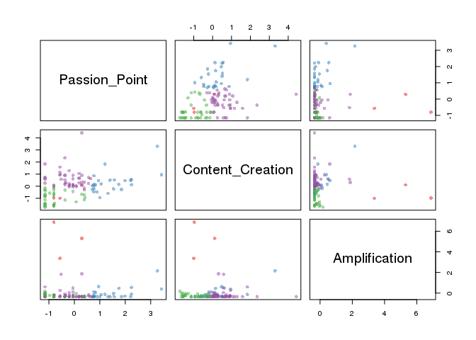

K-mean with label, 109 users
================
DacDinh
6/13/2018

Cài đặt package

Đi load dữ liệu đầu vào là 109 users với nhãn đã được đính sẵn

``` r
# label = 1

library(readxl)
advo  <- read_excel("~/DacDinh/K-mean with label, 109 user/Output_1.1 (label).xlsx",
                    sheet = "Advo_label")

# label = 2
retail <- read_excel("~/DacDinh/K-mean with label, 109 user/Output_1.1 (label).xlsx",
                    sheet = "Retail_label")

# label = 3
kol <- read_excel("~/DacDinh/K-mean with label, 109 user/Output_1.1 (label).xlsx",
                    sheet = "KOL_label")

# label = 4
neutral <- read_excel("~/DacDinh/K-mean with label, 109 user/Output_1.1 (label).xlsx",
                    sheet = "Neutral_label")
```

Đi biến đổi dữ liệu

``` r
library(dplyr)
```

    ## 
    ## Attaching package: 'dplyr'

    ## The following objects are masked from 'package:stats':
    ## 
    ##     filter, lag

    ## The following objects are masked from 'package:base':
    ## 
    ##     intersect, setdiff, setequal, union

``` r
check = rbind(advo, retail, kol, neutral)
comp = check %>% select(Passion_Point, Content_Creation ,Amplification, Brand_Advo)
comp = as.data.frame(scale(comp, center = T, scale = T))
```

Chạy k-mean với n= 25, chọn ra 4 nhóm

``` r
f4 = comp %>% select(Passion_Point, Content_Creation, Amplification)

k <- kmeans(f4, 4, nstart=25, iter.max=1000)

library(RColorBrewer)
library(scales)
palette(alpha(brewer.pal(9,'Set1'), 0.5))
plot(f4, col=k$clust, pch=16)
```



``` r
# cluster
# Cluster sizes
sort(table(k$clust))
```

    ## 
    ##  1  2  3  4 
    ##  3 25 35 46

``` r
clust <- names(sort(table(k$clust)))


#plot 3d
#library(rgl)
#plot3d(data$Passion_Point, samsung$Content_Creation, samsung$Amplification, type = "s", size = .7, col = brewer.pal(4, "Dark2")[k$cluster] )

# cluster
nhom1 = check[row.names(check[k$clust==4,]),] %>% select(ID, Passion_Point, Content_Creation, Amplification, Brand_Advo, Label )

nhom2 = check[row.names(check[k$clust==2,]),] %>% select(ID, Passion_Point, Content_Creation, Amplification, Brand_Advo, Label)

nhom3 = check[row.names(check[k$clust==1,]),] %>% select(ID, Passion_Point, Content_Creation, Amplification, Brand_Advo, Label)

nhom4 = check[row.names(check[k$clust==3,]),] %>% select(ID, Passion_Point, Content_Creation, Amplification, Brand_Advo, Label)
```

Xem dữ liệu các nhóm

``` r
nhom1
```

    ## # A tibble: 46 x 6
    ##    ID        Passion_Point Content_Creation Amplification Brand_Advo Label
    ##    <chr>             <dbl>            <dbl>         <dbl>      <dbl> <dbl>
    ##  1 10000014…         0.515             9.30         1.67        4.86     1
    ##  2 10000034…         0.687             6.54         0.446       4.50     1
    ##  3 10000152…         0.742             5.87         1.95        4.59     1
    ##  4 639243065         0.734             6.61         0           4.85     1
    ##  5 11842881…         0.316            14.5          0           4.57     1
    ##  6 18136094…         0.472             3.72         0           1.76     1
    ##  7 737522356         0.656             5.08         0           3.33     1
    ##  8 792112070         0.482             6.00         1.56        2.99     1
    ##  9 10000120…         0.406             5.72         0           2.32     1
    ## 10 10000015…         0.558             6.62         0           3.69     1
    ## # ... with 36 more rows

``` r
nhom2
```

    ## # A tibble: 25 x 6
    ##    ID        Passion_Point Content_Creation Amplification Brand_Advo Label
    ##    <chr>             <dbl>            <dbl>         <dbl>      <dbl> <dbl>
    ##  1 10000014…         0.515             9.30         1.67        4.86     1
    ##  2 10000034…         0.687             6.54         0.446       4.50     1
    ##  3 10000152…         0.742             5.87         1.95        4.59     1
    ##  4 639243065         0.734             6.61         0           4.85     1
    ##  5 11842881…         0.316            14.5          0           4.57     1
    ##  6 18136094…         0.472             3.72         0           1.76     1
    ##  7 737522356         0.656             5.08         0           3.33     1
    ##  8 792112070         0.482             6.00         1.56        2.99     1
    ##  9 10000120…         0.406             5.72         0           2.32     1
    ## 10 10000015…         0.558             6.62         0           3.69     1
    ## # ... with 15 more rows

``` r
nhom3
```

    ## # A tibble: 3 x 6
    ##   ID         Passion_Point Content_Creation Amplification Brand_Advo Label
    ##   <chr>              <dbl>            <dbl>         <dbl>      <dbl> <dbl>
    ## 1 100000140…         0.515             9.30         1.67        4.86     1
    ## 2 100000346…         0.687             6.54         0.446       4.50     1
    ## 3 100001527…         0.742             5.87         1.95        4.59     1

``` r
nhom4
```

    ## # A tibble: 35 x 6
    ##    ID        Passion_Point Content_Creation Amplification Brand_Advo Label
    ##    <chr>             <dbl>            <dbl>         <dbl>      <dbl> <dbl>
    ##  1 10000014…         0.515             9.30         1.67        4.86     1
    ##  2 10000034…         0.687             6.54         0.446       4.50     1
    ##  3 10000152…         0.742             5.87         1.95        4.59     1
    ##  4 639243065         0.734             6.61         0           4.85     1
    ##  5 11842881…         0.316            14.5          0           4.57     1
    ##  6 18136094…         0.472             3.72         0           1.76     1
    ##  7 737522356         0.656             5.08         0           3.33     1
    ##  8 792112070         0.482             6.00         1.56        2.99     1
    ##  9 10000120…         0.406             5.72         0           2.32     1
    ## 10 10000015…         0.558             6.62         0           3.69     1
    ## # ... with 25 more rows
